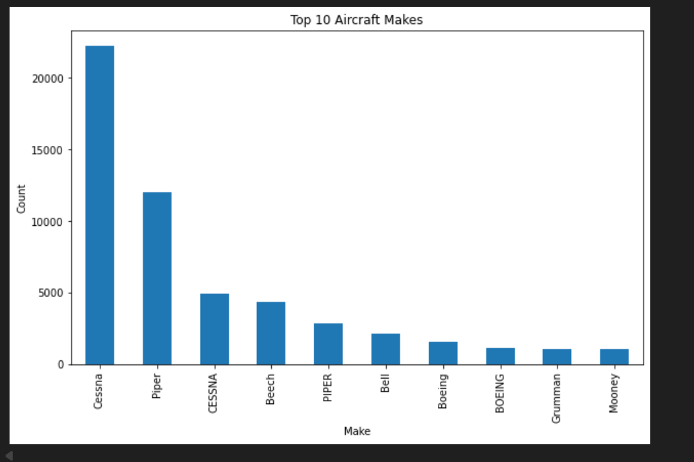
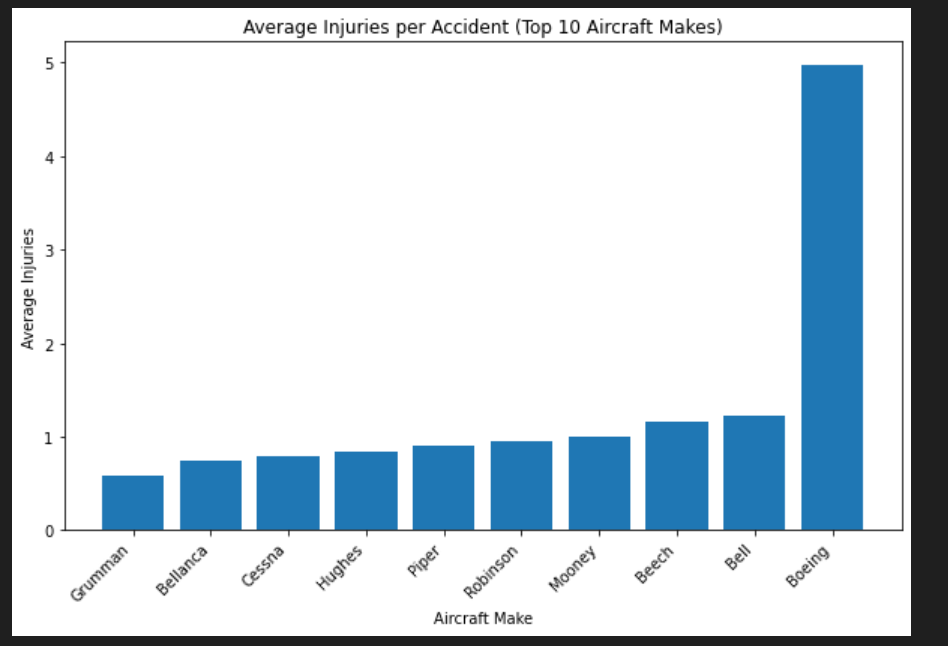
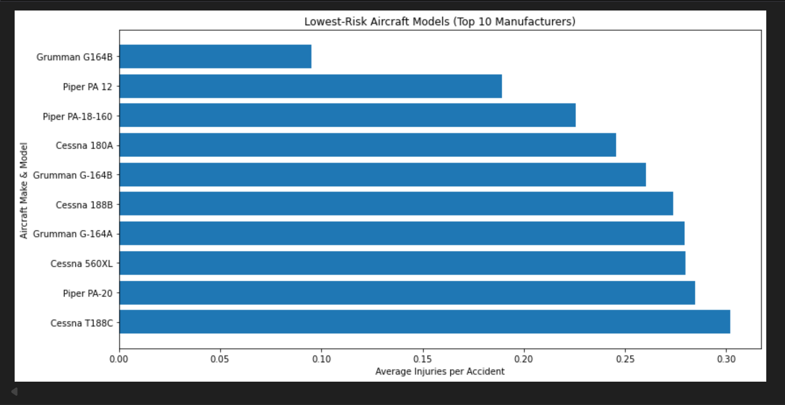
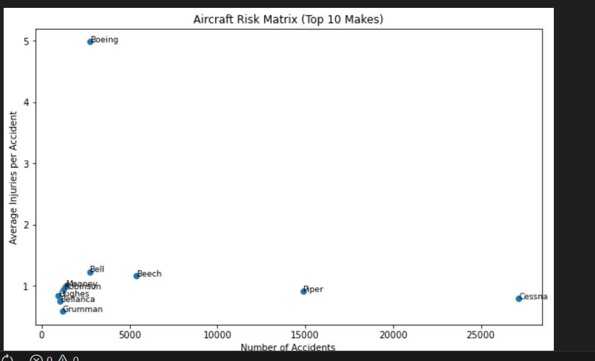
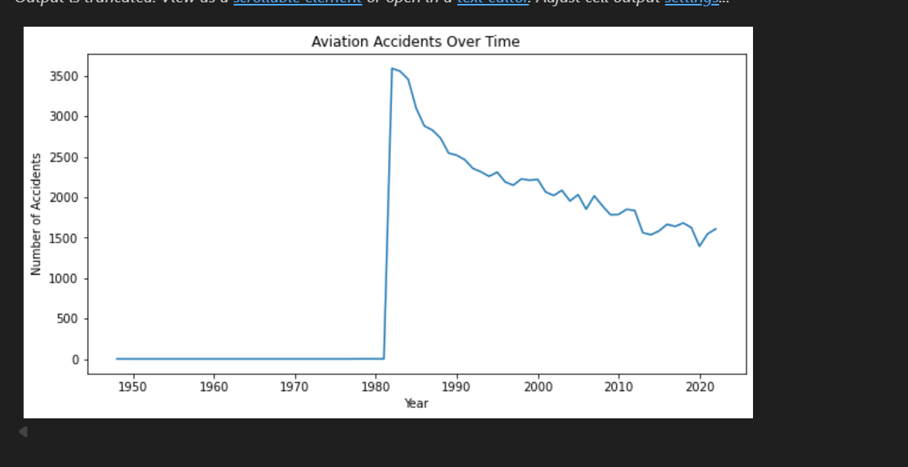

#  Aircraft Risk Analysis for Business Expansion

##  Overview
This project analyzes historical aviation accident data to identify low-risk aircraft makes and models. The goal is to support our company planning to expand into commercial and private aviation operations by providing data-driven, actionable insights on aircraft safety.

The analysis focuses on injury outcomes as a proxy for operational risk and translates findings into business recommendations and an interactive Tableau dashboard.

**Interactive Tableau Dahboard**

[View the Aircraft Safety Risk Dashboard](https://public.tableau.com/app/profile/brenda.chepkemoi/viz/AviationRiskAnalysis_17660036827440/Dashboard1)

##  Business Understanding
The company aims to diversify its portfolio by purchasing and operating aircraft but lacks expertise in aviation risk.

Stakeholders: Aviation safety authorities, aircraft operators, insurance companies, and aviation division heads.

### Business Questions
- Which aircraft makes and models have the lowest injury risk?
- How can historical accident data inform safer aircraft purchase decisions?
- What actionable insights can leadership use to guide expansion into aviation?

##  Data Understanding

 **Dataset:** Aviation accident data (`AviationData.csv`)

 **Source:** National Transportation Safety Board (NTSB) aviation accident datase

 **Key Fields:**

  - Aircraft Make & Model
  - Fatal, Serious, and Minor Injuries

  Total Entries: 88,889 Columns: 31 Float Variables: 6 Object Data Types: 26 Data Sample Code:

  
### Data Preparation
Focused on cleaning columns that were relevant in my analysis.

- Cleaned missing injury values which were treated as zero values.
- Removed dataframes which were irrelevant to my analysis like Longitudes,Latitutes.
- in Categorical data I Input **unknown** to NaN values.
- Created a new metric: **Total Injuries**

##  Data Analysis
Filtered top 10 Makes to use in my analysis

### Average Injuries per Accident (Top 10 Makes)

- Aircraft with low average injuries and sufficient accident history were classified as low-risk

### Lower Risk Aircraft by Make and model

### Aircraft Risk Matrix

Aircraft in the lower-left quadrant represent the lowest risk like Grumman, Hughes, Bell  

### Trend analysis over time

Injuries reduces by number of years

## Conclusion

- Injury types (fatal, serious, minor) are strongly correlated, validating the use of total injuries as a risk metric. 

- These are the top aircrafts that i used in my analysis to determin which aircraft to purchase Cessna, Piper,Beech, Bell, Boeing,  Grumman, Mooney.

- Cessna has high accident while Boeing,Grumman and Bell have the fewer.

- Injuries reduce from time as from 1981 to 2020 it lowered steadily.

##  Recommendations

- **Aircraft Acquisition Strategy**

- Focus on aircraft from manufacturers such as Grumman, Bellanca, Hughes, and select Grumman G164B and Piper PA 12 models, which consistently show lower average injuries per accident.

- Avoid aircraft manufacturers and models that appear in the high-risk in the risk matrix, particularly those with high injury severity, such as certain Boeing models, despite their lower accident frequency.

 **Type and numberof Engines**
  - Opt for aircraft with 2  engines for low fatality rate.The Geared Turbofan, LR and Electric have low fatality rate which is also recommended.

  **Trend Analysis**
  Choose aircraft models that are recent as they have low injury rate as trend shows decreasing accidents over time

##  Author
**Brenda Chepkemoi**  

